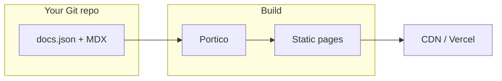

<Steps>
  <Step title="Run Portico locally">
    From the repository root: `npm install` then `npm run dev`. No extra clone is required —
    the demo content is used automatically.
  </Step>
  <Step title="Point at your docs">
    Set `CONTENT_ROOT` to your own docs repository path, or use `CONTENT_GIT_REPO` on
    Vercel to clone docs during the build.
  </Step>
  <Step title="Deploy">
    Run `npm run validate && npm run build`, then deploy the Next.js output to Vercel or any Node
    host. Trigger rebuilds when your docs repo changes (deploy hook or GitHub Action).
  </Step>
</Steps>

## Sample API call

```bash
curl -s https://api.example.com/v1/health | jq .
```

## Architecture



<Warning>
  Replace example URLs before publishing your own documentation site.
</Warning>
